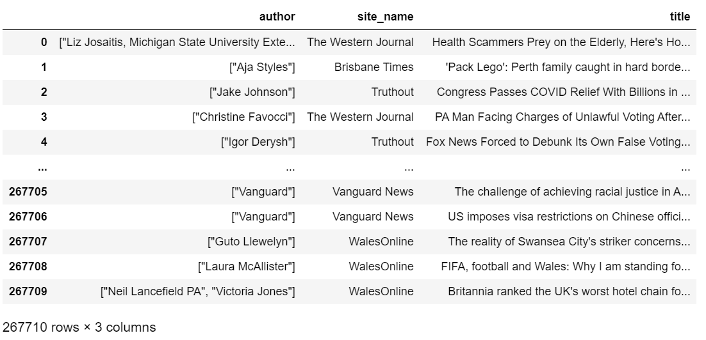
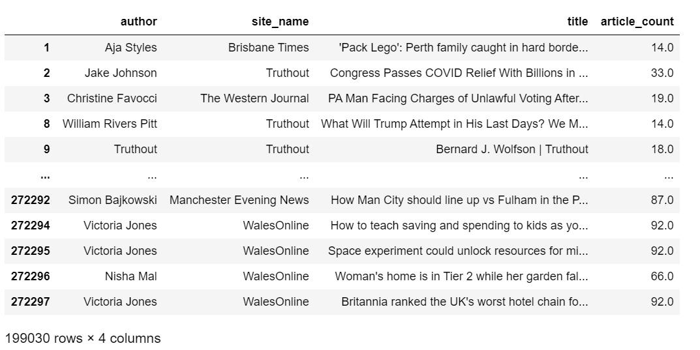
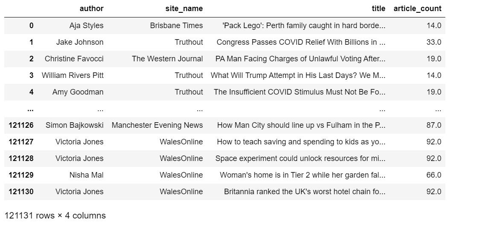
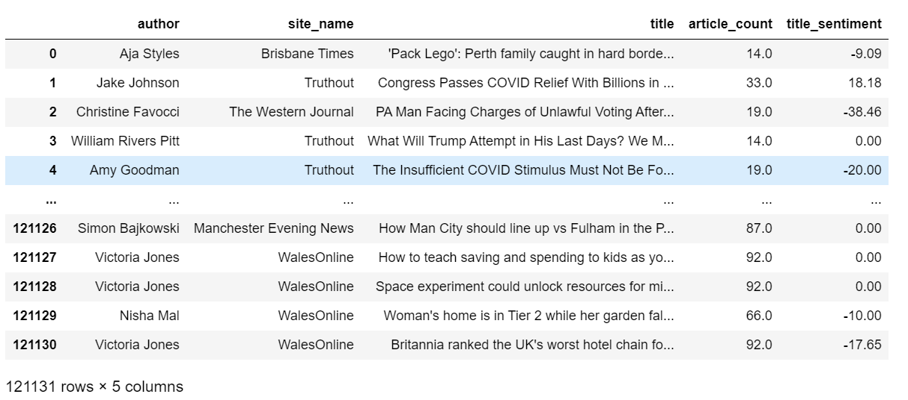
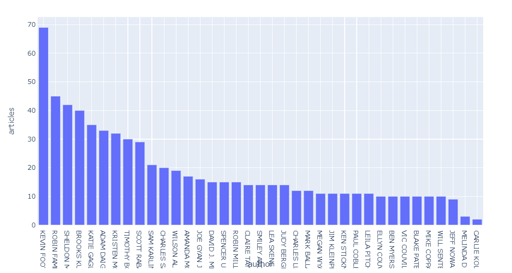
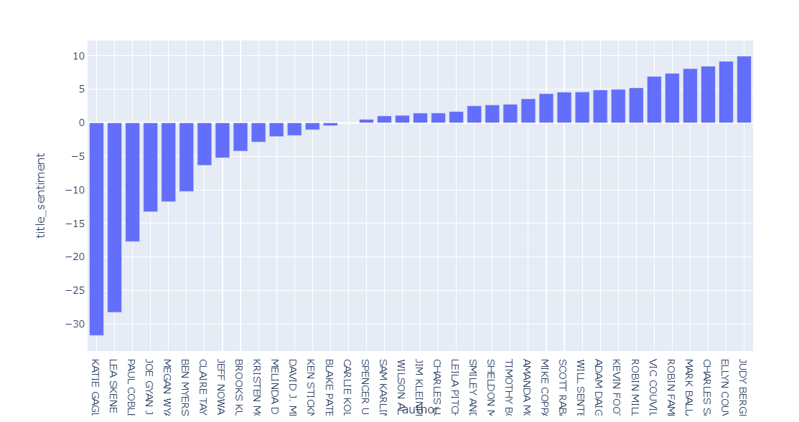

# Press release distribution: EDA on journalist data.

To have an edge above the rest, businesses today need effective press coverage in the form of press releases. They're important for your public relations and keeping your game strong. But none of that happens unless you distribute them to the right journalists in your domain!

To take the right decision in identifying which journalists might be more likely to pick up your releases, we can first start by exploring their history - what kinds of articles they write, how popular they are, and identifying their niche. This article aims to do some initial EDA on the dataset found [here.](https://e1-testing-public-bucket.s3.amazonaws.com/pickled_df.pkl)

We'll start off the process by loading the dataframe, `news`, in the pickle file and examining the columns. I've popped out the index column and reset the indices, leaving us with the following fields in the dataframe: author, crawl_date, crawl_desc, crawl_url, date, description, full_text, img_url, site_name, title, topic, url, webpage_source and lang.

For now, we'll pick the author, site_name, and title columns to get a fair idea of what we're working with. 



Note that the author column contains a JSON object of authors who have worked on the particular article. We can use `json.loads` to extract the information from it. While we're at it, if the list of names contains more than 1 author, we can add new rows for each of those individual authors to the dataframe.

```
data = []
def convert_type(authors, site, title):
    try: 
        temp = [i for i in json.loads(authors) if i]
        if len(temp) > 1: 
            for author in temp[1:]:
                data.append([author, site, title])
        return temp[0] if temp else None
    except:
        return None
	
news['author'] = news.apply(lambda x: convert_type(x['author'], x['site_name'], x['title']), axis=1)

news = news.append(pd.DataFrame(data, columns=['author', 'site_name', 'title']), ignore_index=True)
```

Now, let's add another column to the dataframe: the number of articles authored by each person for every row. For this, we can simply use `count` with `groupby.` We can also set a limit to how many articles a person must have authored. Here, any person who has written less than 10 articles is dropped.

```
news['article_count'] = news.groupby('author')['author'].transform('count')
news = news[news.article_count >= 10]
```



The author column seems to be problematic, with junk values like ['[""]', '["Reuters"]', '["Reuters Staff"]' and
'["Deutsche Welle (www.dw.com)"]'. Since we're focusing on individual journalists and not the outlets they work for, we can create a list of names to filter out those rows. There are also some names that are not in English, so we can combine all these junk names in a list and remove any rows whose names match those in the list. This leaves us with a more concise dataframe.

```
remove = {'', 'Reuters', 'Reuters Staff', 'Associated', 'Vanguard', 'ABC News', 'The Washington Times http://www.washingtontimes.com', 'BWW News Desk', 'Press Trust of India', 'Press Association', 'PTI', 'Capital Market', 'PA Media', 'The Korea Herald', 'SA Transcripts', 'Deutsche Welle (www.dw.com)', 'Associated Press', 'Afp', 'India.com News Desk', 'The Associated Press'... 250 items}

for i in range(len(news)):
    if not ''.join(filter(lambda character:ord(character) < 0x3000, news.iloc[i].author)):
        remove.add(news.iloc[i].author)

news = news[~news['author'].isin(remove)]

news = news.reset_index()
news.pop('index')
```



Now, we can calculate the sentiments for the title of the article in each row. As of now, I used the basic Afinn Lexicon, but better options may be explored. Scores above 0 express positive sentiments, below 0 express negative sentiments. At 0, it can be classified as neutral. We can see that the scores across the dataframe range from -160 to 150, and they seem to be fairly balanced as the mean is almost at 0.

```
afinn = Afinn(language='en')
def get_title_sentiment(text):
    return round(afinn.score(text) / len(text.split()) * 100, 2)
news['title_sentiment'] = news.apply(lambda x: get_title_sentiment(x['title']), axis=1)
```



We can now easily find the top journalists in any outlet by filtering and grouping the data, and easily viewing the visualization in a Plotly.express chart. It allows us to view the most popular authors in any media outlet, say CNN or Reuters and the number of articles contributed by them.

```
def get_top_journalists(source):
    temp = news[news.site_name == source]
    temp = temp.sort_values(by = ['article_count'], ascending = False)
    temp['article_count'] = temp.groupby('author')['author'].transform('count')
    temp = temp.author.value_counts().reset_index()
    temp = temp.rename(columns = {"author": "articles"})
    temp = temp.rename(columns = {"index": "author"})
    return temp

fig = px.bar(get_top_journalists('The Advocate'), x = 'author', y = 'articles')
fig.show()
```



Here's another function which now visualizes the average sentiment of the articles by authors in the media outlet. This allows us to make inferences about which people's articles carry a more positive, neutral, or negative tone.

```
def source_sentiments(source):
    temp = news[news.site_name == source]
    temp = temp.sort_values(by = ['title_sentiment'], ascending = False)
    temp = temp.groupby('author')['title_sentiment'].mean()
    temp = temp.reset_index()
    temp = temp.sort_values(by = ['title_sentiment'])
    return temp

fig = px.bar(source_sentiments('The Advocate'), x = 'author', y = 'title_sentiment')
fig.show()
```



## All done! But there are still some limitations we can face:
- Some (very rare) author names contain phone numbers, titles, or email addresses right along with their name. We can probably solve it by examining those cases and using regex.
- Afinn Lexicon may not be the best option for the sentiment analysis: since it calculates an average score on the words in the text without considering their order, shifts in polarity in the middle of the sentence are not recognized.